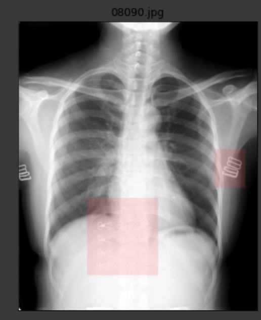
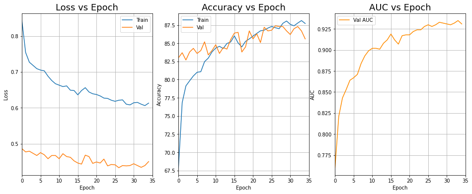
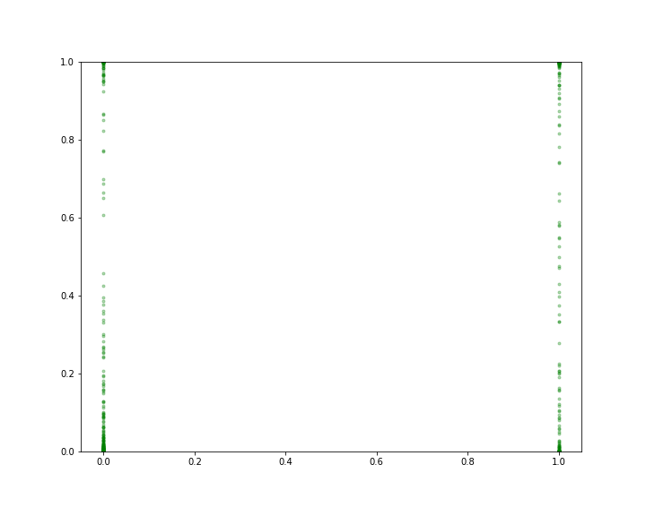
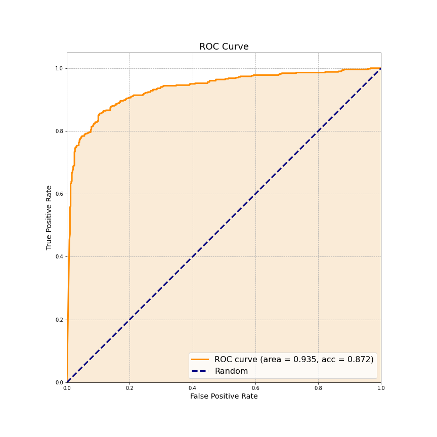
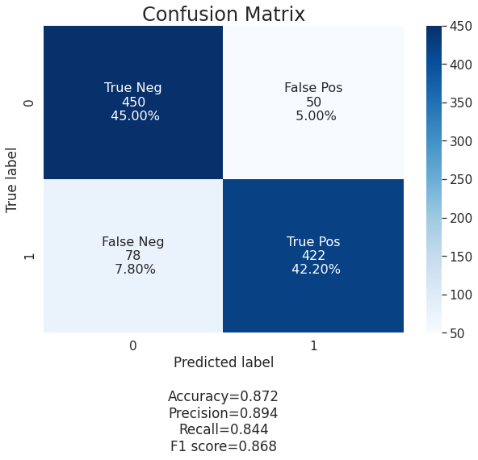

# Foreign Object Classifier in Lung CT Scans
This project is a machine learning project which classifies whether a CT scan contains foreign objects. It is
made using Python and PyTorch, a deep learning framework, and the model is trained on a large dataset of chest X-rays
with strong annotations of foreign objects. Specifically, 4000 frontal chest X-ray images
with foreign objects (all manually annotated) as well as 4000 frontal chest X-ray images without. A further 1000 images (500 with and 500 without) are used for the validation set, in
addition to the 1000 images (500 with and 500 without) used for the test set. 
The dataset can be obtained [here](https://2020.midl.io/challenges.html) under the
challange "object-CXR". I recommend using [Google Colab](https://colab.research.google.com/) as it provides
a free GPU, which could significantly reduce training time if you don't have a powerful GPU on your local computer.

## Files
* **Inception_v3.ipynb** : the main training script, neural net architecture is the inception v3 model.
* **inception_v3_test_set_evaluator.ipynb** : the script in which the trained model is tested on test set, also contains 
graphs of the performance of model.

## Technical Details
- **Data Augmentation** : Various transforms (such as `transforms.RandomAffine()`, `transforms.RandomVerticalFlip()`)
are applied to train images using the PyTorch library `torchvision.transforms`
before loading into a `DataLoader`. This helps the model to generalise better and increases model's performance.
- **Feature Scaling** : The image tensors are normalised using `tranforms.Normalize()` to help get data within a range
and reduces the skewness which helps the model learn faster and better.
- **Mini-batch Gradient Descent** : The data is batched into a batch of 8, fewer updates of the model means gradient
descent is more computationally efficient.
- **Use of Pre-trained Inception v3** : The model architecture used in this project is inception v3, a deep neural 
network which makes use of factorised 7 x 7 convolutions, batch normalisation in auxiliary classifiers, as well as 
label smoothing.

## Training Results

## Model Performance on Test Set

### Predicted Labels vs Actual Labels Concentration

### Receiver Operating Characteristic (ROC) Curve

### Confusion Matrix

